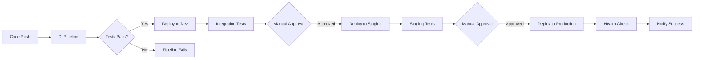

# ACB Demo System API - CI/CD Setup

This repository contains a Mule 4 System API with complete CI/CD pipeline setup for GitHub Actions and CloudHub 2.0 deployment.

## 🚀 CI/CD Pipeline Overview

The CI/CD pipeline consists of two main workflows:

### 1. **CI Pipeline** (`ci.yml`)
- **Triggers**: Push/PR to `main` or `develop` branches
- **Jobs**:
  - **Build & Test**: Compiles, tests, and packages the Mule application
  - **Security Scan**: Runs vulnerability and SAST scans
- **Artifacts**: Test results, coverage reports, and application JAR

### 2. **CD Pipeline** (`cd.yml`)
- **Triggers**: Successful CI completion on `main` branch
- **Environments**: Development → Staging → Production
- **Features**: 
  - Progressive deployment with health checks
  - Environment-specific configurations
  - High availability for production

## 🔧 Required GitHub Configuration

### Repository Secrets
Add these secrets in your GitHub repository settings (`Settings > Secrets and variables > Actions`):

```
ANYPOINT_USERNAME=your-anypoint-username
ANYPOINT_PASSWORD=your-anypoint-password
```

### Repository Variables
Add these variables for each environment:

#### Development Environment
```
APP_NAME_DEV=acb-demo-s-api-dev
ENVIRONMENT_DEV=Development
BUSINESS_GROUP=your-business-group-id
```

#### Staging Environment
```
APP_NAME_STAGING=acb-demo-s-api-staging
ENVIRONMENT_STAGING=Staging
```

#### Production Environment
```
APP_NAME_PROD=acb-demo-s-api-prod
ENVIRONMENT_PROD=Production
```

### GitHub Environments
Create the following environments in your repository (`Settings > Environments`):

1. **development**
   - No protection rules (auto-deploy)
   
2. **staging**
   - Require reviewers: 1 reviewer
   - Deployment branches: `main` only
   
3. **production**
   - Require reviewers: 2 reviewers
   - Deployment branches: `main` only
   - Wait timer: 5 minutes

## 📋 Prerequisites

### Anypoint Platform Setup
1. **Connected App** (Recommended for production):
   - Create a Connected App in Anypoint Platform
   - Use Client ID/Secret instead of username/password
   
2. **Business Groups & Environments**:
   - Ensure Development, Staging, and Production environments exist
   - Verify CloudHub 2.0 is available in your organization
   
3. **Permissions**:
   - Deploy applications to CloudHub 2.0
   - Access to Anypoint Exchange
   - Runtime Manager permissions

### Maven Configuration
The pipeline automatically configures Maven settings with:
- Anypoint Exchange repository access
- Mule Enterprise repository access
- CloudHub 2.0 deployment plugin

## 🏗️ Pipeline Features

### CI Pipeline Features
- ✅ **Multi-stage build**: Validate → Compile → Test → Package
- ✅ **Dependency caching**: Faster builds with Maven cache
- ✅ **MUnit testing**: Automated unit tests with coverage
- ✅ **Security scanning**: Vulnerability and SAST analysis
- ✅ **Artifact management**: Test results and application artifacts
- ✅ **Quality gates**: Code quality checks

### CD Pipeline Features
- ✅ **Progressive deployment**: Dev → Staging → Production
- ✅ **Environment protection**: Manual approvals for higher environments
- ✅ **Health checks**: Automated application health verification
- ✅ **Rollback capability**: Easy rollback on deployment failures
- ✅ **Resource scaling**: Environment-specific resource allocation
- ✅ **High availability**: Production deployment with HA enabled

## 🔄 Deployment Flow



## 📊 Resource Allocation

| Environment | Replicas | vCores | High Availability |
|-------------|----------|--------|-------------------|
| Development | 1        | 0.1    | ❌                |
| Staging     | 2        | 0.2    | ❌                |
| Production  | 3        | 0.5    | ✅                |

## 🛠️ Local Development

### Running Locally
```bash
# Clone the repository
git clone <repository-url>
cd acb-demo-s-api

# Run the application locally
mvn clean compile mule:run

# Test the endpoint
curl http://localhost:8081/demo
```

### Running Tests
```bash
# Run MUnit tests
mvn clean test

# Run tests with coverage
mvn clean test -Dmunit.coverage.report=true
```

## 🔍 Monitoring & Troubleshooting

### Pipeline Monitoring
- **GitHub Actions**: Monitor pipeline execution in the Actions tab
- **Anypoint Runtime Manager**: Monitor application health and performance
- **CloudHub 2.0 Logs**: Access application logs for troubleshooting

### Common Issues
1. **Authentication Failures**: Verify Anypoint credentials in secrets
2. **Deployment Timeouts**: Increase deployment timeout in CD pipeline
3. **Resource Constraints**: Adjust vCores/replicas based on requirements
4. **Environment Access**: Ensure proper permissions for target environments

## 📚 Additional Resources

- [Mule 4 Documentation](https://docs.mulesoft.com/mule-runtime/4.4/)
- [CloudHub 2.0 Deployment](https://docs.mulesoft.com/runtime-manager/cloudhub-2/)
- [GitHub Actions Documentation](https://docs.github.com/en/actions)
- [MuleSoft CI/CD Best Practices](https://docs.mulesoft.com/mule-runtime/4.4/deploy-to-cloudhub)

## 🤝 Contributing

1. Create a feature branch from `develop`
2. Make your changes and add tests
3. Create a Pull Request to `develop`
4. After review and merge, changes will be deployed through the pipeline

## 📞 Support

For issues with the CI/CD pipeline or deployment, please:
1. Check the GitHub Actions logs
2. Review CloudHub 2.0 deployment logs
3. Contact the DevOps team or create an issue in this repository
